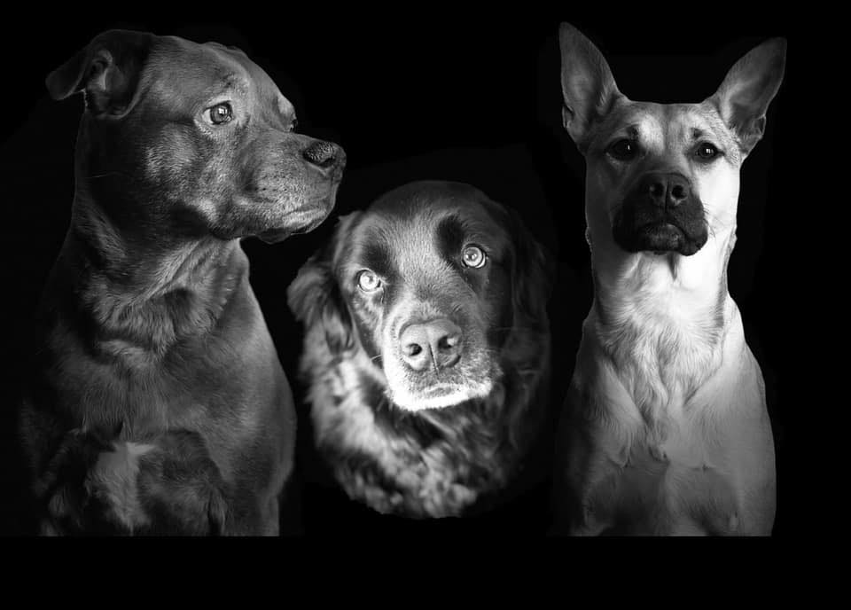

## PA4 

--

- This was an awesome assignment to tie everything together.

--

- This presentation will show you my experience of this PA. But first...

--

- you will look at a picture of my dogs. 

--

- This is unavoidable. 

---

Olive, Kevin, and Phyllis. 

---

